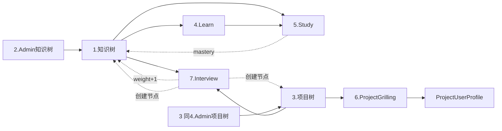

# Java Backend 重写计划（按功能模块组织）

> 目标：用 **Spring Boot 3 + Spring MVC（虚拟线程） + MyBatis @注解 + Spring AI + LangChain4j** 重写 Python `backend/`，**独立新建数据库**（同一 PG 实例，新 DB + 新 user，空库起步）。
> 本文档按 **功能模块** 组织（不按时间阶段），每个模块独立可讨论 / 独立可实现 / 独立可验收。
>
> 参考蓝本：
> - 唯一技术设计：[docs/TECH_DESIGN.md](TECH_DESIGN.md)
> - 通用规范（Python）：[CONVENTIONS.md](../CONVENTIONS.md)
> - 通用规范（Java）：[java-backend/CONVENTIONS.md](../java-backend/CONVENTIONS.md)
> - 技术选型决策记录：[java-backend/docs/ADR.md](../java-backend/docs/ADR.md)
> - Python 源码：[backend/](../backend/)

---

## 0. 基础设施（横切，所有模块共用） — ✅ S0 已完成

**摘要**：Spring Boot 3.3 + Spring MVC（虚拟线程）+ MyBatis 3.0（@注解 Mapper）+ HikariCP + Flyway + Spring AI 1.0（DeepSeek）+ LangChain4j 1.0（DashScope embedding）。独立 DB `interview_agent_java` / user `iagent_java`，空库起步，Flyway V1 一次性建 15 张表。

**详细设计、交付物清单、本地启动步骤、验收记录**见 → [java-backend/docs/modules/S0-infrastructure.md](../java-backend/docs/modules/S0-infrastructure.md)

---

## 模块清单（共 10 个）

| # | 模块 | 包 | 路由前缀 | 涉及表 | 优先级 |
|---|---|---|---|---|---|
| 1 | 知识树（查询） | `knowledge/` | `/api/knowledge` | `knowledge_node` | P0（✅ S2 完成） |
| 2 | 知识树管理（Admin） | `admin/` | `/api/admin/tree-nodes`、`/api/admin/trees/*` | `knowledge_node` | P1（CRUD ✅ S1；树生成 ✅ S5 部分完成：from-text + from-generate） |
| 3 | 项目树管理（Admin） | `admin/` | `/api/admin/project-nodes` | `project_node` | P1 |
| 4 | Learn 讲解 + 探索对话 | `learn/` | `/api/learn` | `knowledge_content`、`learn_chat`、`study_question` | P0 |
| 5 | Study 学习闭环 | `study/` | `/api/study` | `study_question`、`question_attempt`、`knowledge_node`（mastery） | P0 |
| 6 | Project Grilling 项目拷打 | `project/` | `/api/project-grilling` | `project`、`project_node`、`question_attempt`、`project_user_profile` | P1 |
| 7 | Interview 面试复盘 | `interview/` | `/api/interview` | `interview_record`、`interview_{knowledge,project,other}_question` | P1 |
| 8 | User Profile 用户画像 | `user/` | `/api/user` | `user` | P2 |
| 9 | Auth（GitHub OAuth） | `auth/` | `/api/auth` | `user` | P3（一期可跳过） |
| 10 | ASR 录音上传 | `interview/`（子能力） | `/api/interview/upload-audio` | — | P3（一期可跳过） |

---

> **模块章节排列说明**：以下章节按**推荐实现顺序**编排（S0 → S10），模块编号保留原值便于交叉引用（mermaid / 模块清单 / Python 对照）。物理顺序为：**2 → 1 → 5 → 4 → 3 → 6 → 7 → 8 → 9 → 10**。其中模块 2（知识树 Admin）实现上拆为 S1（CRUD）与 S5（树生成）两阶段，文档内仍合并展示。

## 2. 知识树管理模块（`admin/` — knowledge 部分）

**目标**：Admin 对知识树做 CRUD + LLM 生成 / 文本解析 / 图片解析 / .mm 导入 / 优化 / 合并。

### 2.1 节点 CRUD — ✅ S1 已完成

5 个端点：`GET /api/admin/tree-nodes`、`POST /api/admin/tree-nodes`、`PUT /api/admin/tree-nodes/{id}`、`PUT /api/admin/tree-nodes/batch-sort`、`DELETE /api/admin/tree-nodes/{id}`。

**详细设计 / 表 / 模块交互 / 验收**见 → [java-backend/docs/modules/S1-knowledge-admin-crud.md](../java-backend/docs/modules/S1-knowledge-admin-crud.md)

### 2.2 树生成（对照 `api/admin/tree_gen.py`）

**Scope A 已完成（S5）**：from-text + from-generate + 两层去重（精确同名 + LLM 语义）。详见 → [java-backend/docs/modules/S5-tree-gen.md](../java-backend/docs/modules/S5-tree-gen.md)

| API | 说明 | 依赖 | 状态 |
|---|---|---|---|
| `POST /api/admin/trees/from-text` | 文本/Markdown → 树 | LLM | ✅ S5 |
| `POST /api/admin/trees/from-generate` | LLM 直接生成 | LLM | ✅ S5 |
| `POST /api/admin/trees/from-image` | 截图 → 树 | qwen-vl-max（视觉） | ⏸ 二期 |
| `POST /api/admin/trees/from-mm` | .mm 文件导入 | XML 解析 | ⏸ 二期 |
| `POST /api/admin/trees/{root_id}/optimize` | LLM 查漏补缺 | LLM | ⏸ 二期 |
| `POST /api/admin/trees/merge` | 合并两棵树 | LLM | ⏸ 二期 |

---

## 1. 知识树查询模块（`knowledge/`） — ✅ S2 已完成

**摘要**：单端点 `GET /api/knowledge/tree`，复用 S1 的 `KnowledgeNodeMapper.findAllOrdered()`，O(n) 把平表组装成嵌套树。`mastery_level / study_count` 占位返回 0，待 S3 完成后由 `QaAggregateService` 注入。

**详细设计 / 表 / 模块交互 / 验收**见 → [java-backend/docs/modules/S2-knowledge-query.md](../java-backend/docs/modules/S2-knowledge-query.md)

---

## 5. Study 模块（`study/`）— 核心闭环

**目标**：推荐知识点 → 选题 → 多轮答题 → Rubric 评分 → 派生掌握度。

| API | 说明 |
|---|---|
| `GET /api/study/knowledge-points?top_n=N` | 推荐 Top N 叶子知识点（按优先度） |
| `GET /api/study/knowledge-points/{kp}/questions` | 该 KP 下题目 + 题目分（首访触发 ensureKpStudied） |
| `POST /api/study/attempts` | 开始作答（body: question_id） |
| `POST /api/study/attempts/{id}/turn` | 提交一轮 → LLM 评估 + 范例 + 追问 |
| `POST /api/study/attempts/{id}/finish` | 综合评分 + rubric_result + extension_qa |
| `GET /api/study/attempts/{id}` | 作答详情 |
| `GET /api/study/questions/{question_id}/attempts` | 该题作答历史 |

**Schema**：
- `study_question` — kp_id, question, reference_answer, rubric(JSONB)
- `question_attempt` — question_id, question_type('study'|'project'), dialog(JSONB), rubric_result(JSONB), score, status, extension_qa(JSONB)

| 类 | 职责 | Python 对照 |
|---|---|---|
| `StudyQuestion` / `QuestionAttempt` (Entity) + Repo | DB | `models/qa.py` |
| `StudyService` | start / turn / finish 编排 | `services/qa_engine.py` |
| `StudyQaStrategy` | per_turn / final_score prompt 策略 | `services/study_qa_strategy.py` |
| `ScoreAggregateService` | 题目分 = 最近 3 次 finished 平均；KP 掌握度 = 该 KP 下所有题目分平均 | `services/qa_aggregate.py` |
| `StudyPrompts` | PER_TURN / FINAL_SCORE | `prompts/qa_per_turn_prompt.py`、`qa_final_score_prompt.py` |
| `StudyController` | 7 个 API | `api/study.py` |

**关键公式**（与 Python 一致）
- 优先度：未学 `weight * 1.0`；已学 `weight * (1 - mastery/100) * 0.8`
- 题目分：`avg(最近 3 次 finished attempt.score)`
- KP 掌握度：`avg(该 KP 下所有题目分)`

---

## 4. Learn 模块（`learn/`）

**目标**：知识点讲解内容的 LLM 生成 / 缓存 / 探索对话 / 对话合并回讲解 + 题目首次自动生成（`ensure_kp_studied`）。

| API | 说明 |
|---|---|
| `GET /api/learn/content/{kp_id}` | 取讲解（不存在 → LLM 生成 + 入库 + 同时生成题目） |
| `DELETE /api/learn/content/{kp_id}` | 删除讲解（保留题目） |
| `POST /api/learn/content/{kp_id}/regenerate-questions` | 重新生成题目 |
| `POST /api/learn/chat` | 探索对话（流式可选） |
| `GET /api/learn/chat-history/{kp_id}` | 对话历史 |
| `POST /api/learn/merge-chat` | 把对话合并回讲解文章（LLM） |

**Schema**：
- `knowledge_content` — kp_id, content_md, version, created_at
- `learn_chat` — kp_id, user_id, role, content, created_at
- `study_question` — kp_id, question, reference_answer, rubric(JSONB)

| 类 | 职责 | Python 对照 |
|---|---|---|
| `KnowledgeContent` / `LearnChat` (Entity) + Repo | DB | `models/learn.py` |
| `LearnService` | ensureKpStudied / generateContent / chat / mergeChat | `services/learn.py` |
| `LearnPrompts` | CONTENT_GEN / QUESTION_GEN / CHAT / MERGE | `prompts/learn_prompts.py` |
| `LearnController` | 6 个 API | `api/learn.py` |

**关键规则**：首次访问 kp 时**幂等**触发 `ensureKpStudied`（讲解 + 题目同时生成）。

---

## 3. 项目树管理模块（`admin/` — project 部分）

**目标**：项目根 → 话题 → 问题 三层树的 CRUD + 文本创建。

| API | 说明 |
|---|---|
| `GET /api/admin/project-nodes` | 完整项目树 |
| `POST /api/admin/project-nodes` | 新增节点（写 embedding） |
| `PUT /api/admin/project-nodes/{id}` | 修改 |
| `PUT /api/admin/project-nodes/batch-sort` | 批量排序 |
| `DELETE /api/admin/project-nodes/{id}` | 递归删除 + FK 置空 |
| `POST /api/admin/project-nodes/from-text` | 文本描述 LLM 解析为 3 层树 + 去重 | 

**Schema**（`project_node`）：`id, parent_id, name, level(1/2/3), sort_order, embedding(vector(1024)), user_id`

| 类 | 职责 |
|---|---|
| `ProjectAdminController` / `ProjectAdminService` | CRUD + level 重算 |
| `ProjectFromTextService` | LLM 解析 + 去重（embedding 相似度） |

---

## 6. Project Grilling 模块（`project/`）

**目标**：项目"拷打"对话 — 选项目 → 选话题 → 选题 → 多轮答题 → 评分 + 累积项目画像。

| API | 说明 |
|---|---|
| `GET /api/project-grilling/projects` | 项目列表（叶子 = 真题） |
| `GET /api/project-grilling/projects/{id}/dimensions` | 项目下话题列表（含话题分） |
| `GET /api/project-grilling/topics/{id}/questions` | 话题下题目列表（含题目分） |
| `POST /api/project-grilling/attempts` | 开始拷打 |
| `POST /api/project-grilling/attempts/{id}/turn` | 一轮回答 |
| `POST /api/project-grilling/attempts/{id}/finish` | 综合评分 |
| `GET /api/project-grilling/attempts/{id}` | 详情 |
| `GET /api/project-grilling/questions/{id}/attempts` | 历史 |
| `GET /api/projects/{id}/profile` | 项目画像（只读） |

**Schema**：
- `project` — id, name, description, user_id
- `project_node` — 三层树（复用模块 3）
- `project_user_profile` — project_id, facts(JSONB), weak_points(JSONB), version（乐观锁）
- `question_attempt` — 复用（question_type='project'）

| 类 | 职责 | Python 对照 |
|---|---|---|
| `ProjectGrillingService` | start / turn / finish 编排 | `services/project_grilling/project_crud.py` |
| `ProjectQaStrategy` | prompt 策略（注入画像） | `services/project_qa_strategy.py` |
| `ProjectProfileService` | loadProfile / renderForPrompt / extractAndApply（乐观锁 + 重试） | `services/project_profile.py` |
| `ProjectGrillingPrompts` | PER_TURN / FINAL_SCORE | `prompts/project_prompts.py` |
| `ProjectProfilePrompts` | EXTRACT_PROFILE | 同 |
| `ProjectGrillingController` / `ProjectProfileController` | API | `api/project_grilling/*.py` |

**关键规则**
- finishAttempt 后 **fire-and-forget** 触发 `extractAndApply`（从 rubric `hit=false` 取 `missed_key_points`）
- patch 合并：update→remove→add→trunc；MAX_FACTS=50 / MAX_WEAK_POINTS=20
- 一期简化：去掉 horizontal/deep_dive 状态机，按 max-follow-ups + LLM 自决终止

---

## 7. Interview 模块（`interview/`）— 链路最长

**目标**：粘贴面试文本 → LLM 解析 turns+groups → pgvector 匹配 knowledge/project 节点 → 按类型评分 → 整体分析 → 落 4 表 + 副作用（更新 mastery weight）。

| API | 说明 |
|---|---|
| `POST /api/interview/preview-parse` | 仅解析，不落库 |
| `POST /api/interview/parse` | preview + finalize |
| `POST /api/interview/finalize` | 校对后落库 |
| `POST /api/interview/check-duplicate` | text_hash(sha256) 去重 |
| `POST /api/interview/overwrite` | 覆盖已有记录 |
| `POST /api/interview/upload-audio` | ASR 上传（P3，可推迟） |
| `POST /api/interview/draft` | 草稿保存 |
| `GET /api/interview/history` | 历史列表 |
| `GET /api/interview/history/{id}` | 详情 |
| `POST /api/interview/history/{id}/recalibrate` | 重算 |
| `DELETE /api/interview/history/{id}` | 删除（级联 3 子表） |
| `PATCH /api/interview/history/{id}` | 更新 company/position |

**子模块拆分**

| 子模块 | 类 | 对照 Python |
|---|---|---|
| 7.1 Turns 切分 | `InterviewTurnsService`（splitIntoTurns / repairTurns / chunkTurns / renderTurnsForLlm） | `services/interview_turns.py` |
| 7.2 Parser | `InterviewParserService`（并发 chunk LLM + embedding 边界合并 + project 话题合并 + 去重 + 锚点重写 + missed_check） | `services/interview_parser.py` |
| 7.3 Matcher | `InterviewMatcherService`（knowledge embedding+rerank / project 3 级匹配 / 缺失节点自动创建） | `services/interview_matcher.py` + `knowledge_node_matcher.py` + `project_node_matcher.py` + `skills/embedding_match_skill.py` |
| 7.4 Scorer | `InterviewScorerService`（按 type 分发评分 + 并发 5 + 整体分析） | `services/interview_scorer.py` |
| 7.5 Storage | `InterviewStorageService`（4 表落库 + 更新 weight + 写 embedding） | `services/interview_storage.py` + `interview_crud.py` |
| 7.6 Crud | `InterviewCrudService`（编排 + 草稿 + 历史 + 重算 + 重复检测） | `services/interview_crud.py` |
| 7.7 ASR | `AsrService`（DashScope Paraformer 异步任务） — P3 | `services/asr.py` + `asr_corrector.py` |

**Schema**（5 张表）
- `interview_record` — raw_text, company, position, text_hash, parsed_questions(JSONB), avg_score, pass_estimate, summary_report
- `interview_knowledge_question` — knowledge_node_id, tag, questions/user_answer/original_dialogue, score_result(JSONB)
- `interview_project_question` — project_node_id, project_name, 同上
- `interview_other_question` — content, tag('hr'|'leetcode'|'misc'), extra(JSONB)

**关键规则**
- text_hash = `SHA-256(raw_text.strip()).hex`
- avg_score → pass_estimate：`≥70 较高 / ≥50 一般 / else 较低`
- matched knowledge node `interview_weight += 1`（上限 5）
- 并发：parser MAX_CONCURRENT=5、scorer MAX_CONCURRENT=5

---

## 8. User Profile 模块（`user/`）

**目标**：用户档案文本的读写。

| API | 说明 |
|---|---|
| `GET /api/user/profile` | 取档案 |
| `PUT /api/user/profile` | 写档案（UPDATE 命中 0 行 → INSERT ON CONFLICT 兜底） |

| 类 | 职责 | Python 对照 |
|---|---|---|
| `UserProfileController` | 2 API | `api/profile.py` |
| `UserProfileService` | 读写 | `services/profile.py` |

一期固定 `user_id=1`。

---

## 9. Auth 模块（`auth/`）— P3 可推迟

**目标**：GitHub OAuth 登录。

| API | 说明 |
|---|---|
| `GET /api/auth/github` | 跳转 GitHub 授权 |
| `GET /api/auth/github/callback` | OAuth 回调（建立 session / 发 token） |
| `GET /api/auth/me` | 当前用户信息 |

| 类 | Python 对照 |
|---|---|
| `AuthController` / `AuthService` | `api/auth.py` |

**注意**：一期 `user_id=1` 写死可跳过本模块。

---

## 10. ASR 录音上传 — P3 可推迟

仅 `POST /api/interview/upload-audio` 一个端点，DashScope Paraformer 异步任务 + 轮询完成后回写文本。归入 Interview 模块的子能力。

---

## 模块依赖关系

**建议实现顺序**（按所有阶段拆分，"先能跑 → 先有数据 → 先核心闭环 → 再扩展"）

| 阶段 | 模块 / 范围 | 交付价值 | 依赖 |
|---|---|---|---|
| **S0** ✅ | 基础设施（0）| Spring Boot 骨架 / Flyway V1 建所有表 / `ApiResponse` / `ChatClient` / `EmbeddingService` / health 接口 | 无 |
| **S1** | 知识树 Admin（2）— 仅节点 CRUD 子集 | 能手动灌数据，后续模块才有输入 | S0 |
| **S2** ✅ | 知识树查询（1）| `GET /api/knowledge/tree` 验证树组装 | S1 |
| **S3** | **Study（5）核心闭环** | 首次跑通 LLM / JSONB / 虚拟线程 / 评分聚合，架构可行性验收 | S2 |
| **S4** | Learn（4）| 讲解 + 探索对话 + ensureKpStudied（依赖 `study_question` 表）| S3 |
| **S5** | 知识树 Admin（2）— 树生成 6 种入口 | from-text / from-generate / from-mm / optimize / merge / from-image（视觉最后）| S4 |
| **S6** | 项目树 Admin（3）| 项目树 CRUD + from-text，为 Project Grilling 备数据 | S0 |
| **S7** | Project Grilling（6）| 复用 `question_attempt` + `project_user_profile` 乐观锁 + fire-and-forget | S3 + S6 |
| **S8a** | Interview（7）— preview-parse / parse / history 列表 | turns / parser / matcher 跑通 | S1 + S6 |
| **S8b** | Interview（7）— finalize / check-duplicate / overwrite + 落库 + 副作用 | scorer / storage + `interview_weight += 1` | S8a |
| **S8c** | Interview（7）— recalibrate / draft / 详情 / 删除 / PATCH | 边角能力 | S8b |
| **S9** | User Profile（8）| 2 API，随时插队 | S0 |
| **S10**（可推迟）| Auth（9）+ ASR（10）| 一期 `user_id=1` 写死可不做 | — |

**MVP 定义**：`S0 → S1 → S2 → S3 → S4` 完成即"以考代学"最小闭环，可交付使用。

**与原顺序的关键调整**
- Admin 节点 CRUD 前置（S1）— 空库起步必须先有动手灌数据的入口，否则后面模块无法验收
- Study 提前到 Learn 之前（S3 先于 S4）— Study 才是核心闭环，且 Learn 依赖 `study_question` 表，原本就应该紧跟 Study
- 知识树 Admin 拆为 S1（CRUD）+ S5（树生成）— 树生成依赖 LLM/视觉更重，不应阻塞核心闭环
- Interview 拆为 S8a/b/c 三步走 — 原本是单模块里链路最长的，一次性做风险大
- from-image / ASR / Auth 均标为 P3 可推迟，不进核心路径

**跨阶段并行性**
- S1 与 S2 可合并（CRUD 写完顺手做查询）
- S5 与 S6 互不依赖，可并行
- S9 随时插队

---

## 验收清单（每阶段完成后）

- [ ] 所有 API curl 单测通过（返回 `{code:0, data, message}`）
- [ ] Flyway V 脚本启动自动执行成功（`flyway_schema_history` 无失败记录）
- [ ] 与 Python 端同语义输入 → 同语义输出（评分波动允许 ±10%）
- [ ] 日志含模块名前缀（如 `[Study] attempt=123 score=85`）
- [ ] IO 密集任务全部跑在虚拟线程；并发编排用 `StructuredTaskScope`
- [ ] 阶段交付打 git tag（如 `java-s1`、`java-s3`），便于回滚

---

## 待讨论项

- [x] ~~WebFlux vs Spring MVC~~ → **Spring MVC + 虚拟线程**
- [x] ~~LangChain4j 版本~~ → **Spring AI 1.x（Chat）+ LangChain4j（Embedding/Vision）** 组合
- [x] ~~Lombok~~ → **不引入**，使用 JDK 21 Record
- [x] ~~构建工具~~ → **Maven**
- [x] ~~数据库共享 vs 独立~~ → **独立新建**（`interview_agent_java` / user `iagent_java`，空库 + Flyway）
- [x] ~~Multi-module Maven~~ → **单 module 起步**，后续按需拆
- [ ] 测试策略：Testcontainers Postgres + pgvector 镜像（`pgvector/pgvector:pg16`）确认可用
- [ ] DeepSeek 的 OpenAI 兼容端点在 Spring AI `ChatClient` 下的结构化输出稳定性需验证（必要时回退到 LangChain4j）
- [ ] 是否引入 `springdoc-openapi` 自动生成 API 文档

