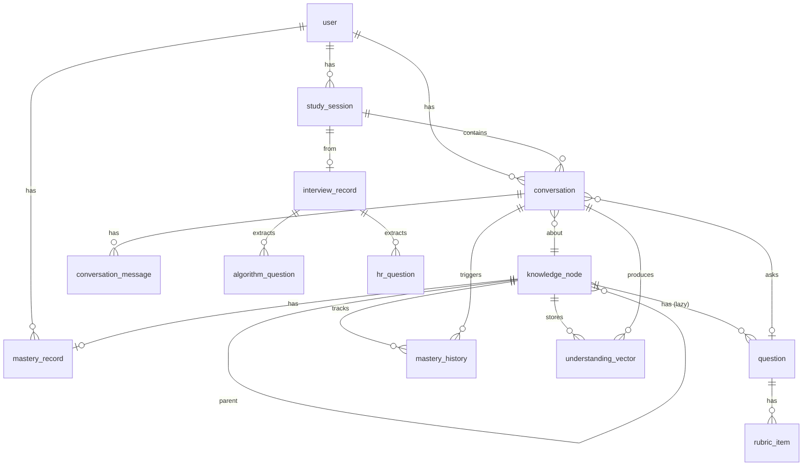
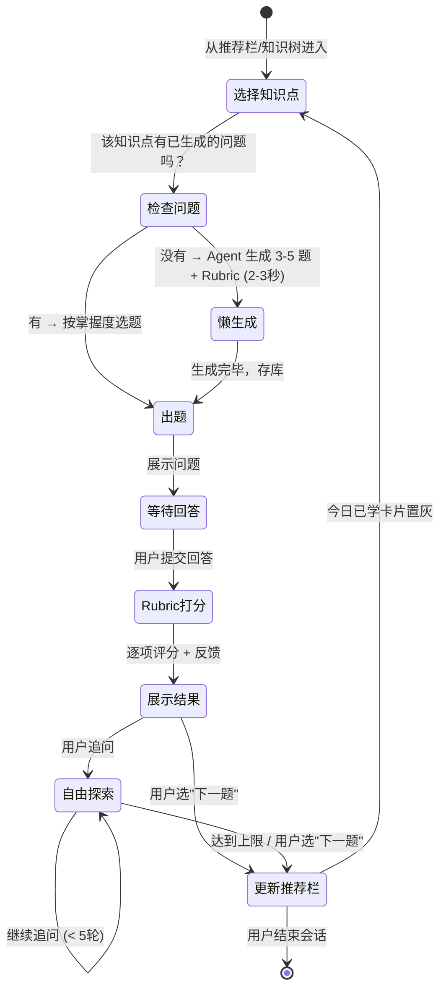
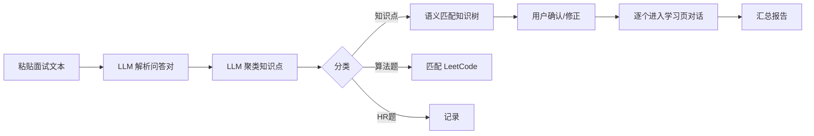
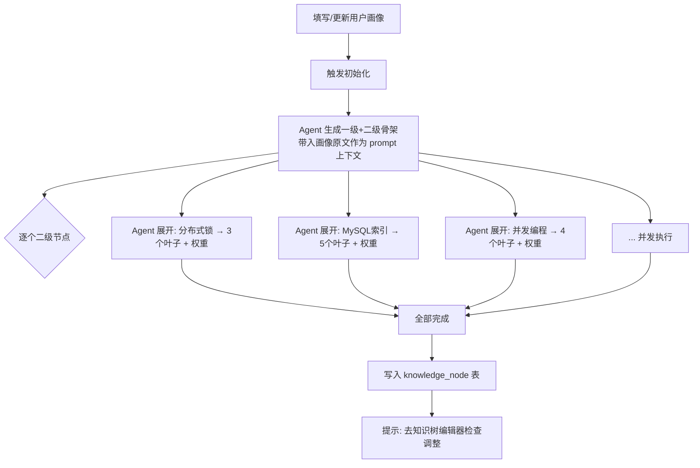
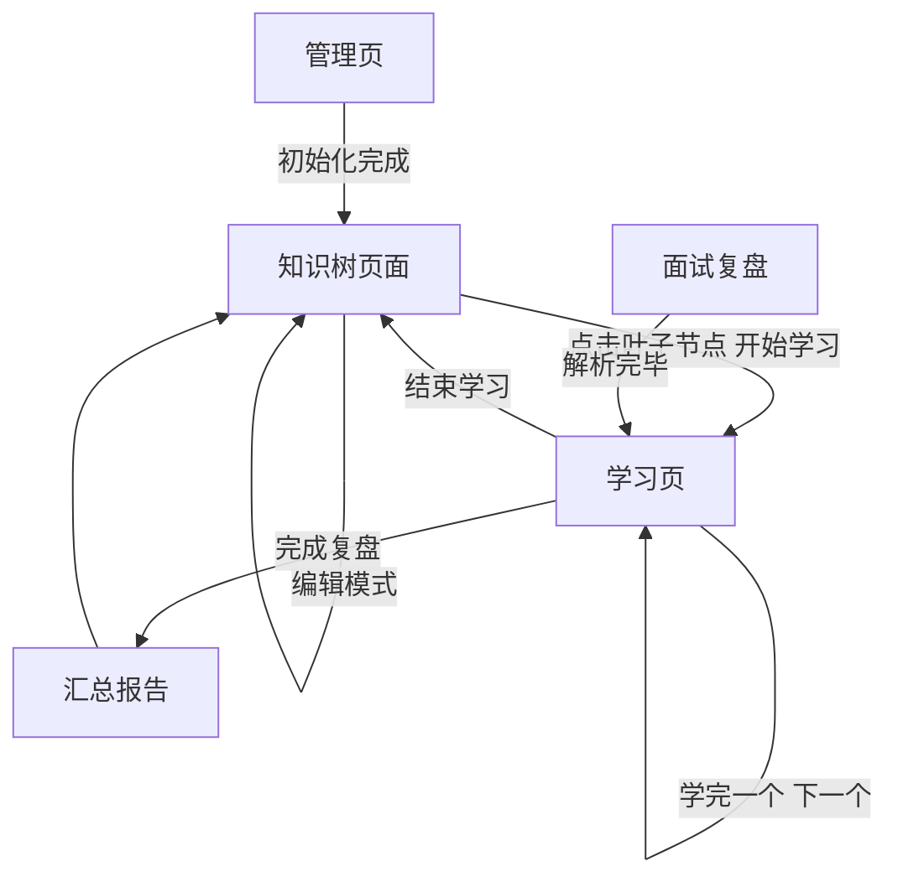

# 面试备考 Agent 系统 — 技术设计文档

> 基于 DESIGN_v2.md 的产品设计，展开数据模型和页面交互设计。

---

## 一、数据模型

### 设计决策

| 决策 | 结论 | 说明 |
|------|------|------|
| 用户系统 | 一期不做，预留字段 | 关键表加 `user_id DEFAULT 1`，二期加多用户无需改表 |
| 角色权限 | 一期不做，预留字段 | user 表预留 `role` 字段，一期不校验 |
| 问题/Rubric | 懒生成 | 首次学习时 Agent 生成，存库复用，不在初始化时批量生成 |
| 面经采集 | 二期 | interview_insight 相关表二期再建 |

### ER 关系总览

```
user (用户，一期仅 1 条默认数据)
  │ 1
  ├──< mastery_record
  ├──< study_session
  └──< conversation

knowledge_node (知识树节点)
  │ 1
  │
  ├──< question (高频问题，懒生成)
  │      │ 1
  │      └──< rubric_item (评分关键点)
  │
  ├──< mastery_record (掌握度，per user per node)
  │
  ├──< mastery_history (掌握度变化历史)
  │
  └──< understanding_vector (用户理解向量)

study_session (学习会话)
  │ 1
  │
  ├──< conversation (对话，每个知识点一次)
  │      │ 1
  │      ├──< conversation_message (消息明细)
  │      └──→ knowledge_node (关联知识点)
  │           question (关联问题)
  │
  ├──< interview_record (面试文本记录，方式A时存在)
  │      │ 1
  │      ├──< algorithm_question (算法题)
  │      └──< hr_question (HR题)
  │
  └─── source_type: text_upload | manual_select

（二期）interview_insight (面经采集，独立 pipeline)
```

---

### 表结构

#### 0. user — 用户（预留，一期仅 1 条默认数据）

```sql
CREATE TABLE "user" (
    id            BIGSERIAL PRIMARY KEY,
    username      VARCHAR(100) NOT NULL UNIQUE,
    password      VARCHAR(200) NOT NULL,       -- 一期可用明文或简单 hash
    role          VARCHAR(20) DEFAULT 'user',  -- 'admin' | 'user'，一期不校验
    profile_text  TEXT,                         -- 用户画像原文（目标岗位、年限、薄弱点等，LLM 解析）
    created_at    TIMESTAMP DEFAULT NOW()
);

-- 一期默认数据
INSERT INTO "user" (username, password, role) VALUES ('admin', 'admin', 'admin');
```

> 一期不做登录校验，所有请求视为 user_id=1。二期加 JWT 即可。
> `profile_text` 由用户自由填写（如"3年Java后端，目标大厂，薄弱分布式和JVM，有订单系统项目经验"），
> Agent 初始化知识树和出题时直接把原文带入 prompt，由 LLM 自行理解。

---

#### 1. knowledge_node — 知识树节点

统一存储所有层级（一级分类 / 二级分类 / 三级叶子节点）。

```sql
CREATE TABLE knowledge_node (
    id            BIGSERIAL PRIMARY KEY,
    parent_id     BIGINT REFERENCES knowledge_node(id),  -- 根节点为 NULL
    name          VARCHAR(200) NOT NULL,
    level         SMALLINT NOT NULL,          -- 1=一级, 2=二级, 3=叶子
    node_type     VARCHAR(20) NOT NULL,       -- 'category' | 'leaf'
    interview_weight SMALLINT DEFAULT 3,      -- ★1-5, 仅叶子有意义
    sort_order    INT DEFAULT 0,
    is_user_created BOOLEAN DEFAULT FALSE,    -- 用户手动创建的节点
    created_at    TIMESTAMP DEFAULT NOW(),
    updated_at    TIMESTAMP DEFAULT NOW()
);

-- 快速查子节点
CREATE INDEX idx_kn_parent ON knowledge_node(parent_id);
-- 按类型筛选叶子
CREATE INDEX idx_kn_type ON knowledge_node(node_type);
```

示例数据：
```
id=1  parent=NULL  name="分布式"        level=1  type=category
id=2  parent=1     name="分布式锁"      level=2  type=category
id=3  parent=2     name="Redis分布式锁"  level=3  type=leaf     weight=5
id=4  parent=2     name="ZK分布式锁"    level=3  type=leaf     weight=3
```

---

#### 2. question — 高频问题

```sql
CREATE TABLE question (
    id                 BIGSERIAL PRIMARY KEY,
    knowledge_point_id BIGINT NOT NULL REFERENCES knowledge_node(id),
    content            TEXT NOT NULL,              -- 问题内容
    standard_answer    TEXT,                       -- 标准答案
    difficulty         SMALLINT DEFAULT 1,         -- 1=基础, 2=进阶, 3=深入
    source             VARCHAR(20) DEFAULT 'agent', -- 'agent' | 'pipeline' | 'user'
    sort_order         INT DEFAULT 0,
    created_at         TIMESTAMP DEFAULT NOW(),
    updated_at         TIMESTAMP DEFAULT NOW()
);

CREATE INDEX idx_q_kp ON question(knowledge_point_id);
```

---

#### 3. rubric_item — 评分关键点

```sql
CREATE TABLE rubric_item (
    id          BIGSERIAL PRIMARY KEY,
    question_id BIGINT NOT NULL REFERENCES question(id),
    key_point   VARCHAR(500) NOT NULL,      -- 关键点描述
    score       SMALLINT NOT NULL,          -- 该关键点的分值
    sort_order  INT DEFAULT 0,
    created_at  TIMESTAMP DEFAULT NOW()
);

CREATE INDEX idx_ri_q ON rubric_item(question_id);
```

示例（question = "Redis 分布式锁怎么实现？"）：
```
key_point="SETNX+EX 原子设置"          score=20
key_point="value 用唯一标识防误删"      score=20
key_point="Lua 脚本保证删除原子性"      score=20
key_point="看门狗续期机制"              score=20
key_point="主从切换丢锁/RedLock"        score=20
```

> **懒生成策略**：question 和 rubric_item 不在知识树初始化时批量生成。
> 用户首次学习某知识点时，Agent 实时生成 3-5 个问题 + Rubric，存库复用。
> 随掌握度提升，Agent 可动态追加进阶问题。

---

#### 4. mastery_record — 掌握度（每个用户每个叶子节点一条）

```sql
CREATE TABLE mastery_record (
    id                 BIGSERIAL PRIMARY KEY,
    user_id            BIGINT DEFAULT 1 REFERENCES "user"(id),  -- 预留多用户
    knowledge_point_id BIGINT NOT NULL REFERENCES knowledge_node(id),
    mastery_level      SMALLINT DEFAULT 0,     -- 0-100, 最近一次得分
    stability_s        FLOAT DEFAULT 1.0,      -- 遗忘曲线 S 参数
    study_count        INT DEFAULT 0,          -- 累计学习次数
    last_studied_at    TIMESTAMP,
    updated_at         TIMESTAMP DEFAULT NOW(),
    UNIQUE(user_id, knowledge_point_id)
);
```

---

#### 5. mastery_history — 掌握度变化历史

```sql
CREATE TABLE mastery_history (
    id                 BIGSERIAL PRIMARY KEY,
    knowledge_point_id BIGINT NOT NULL REFERENCES knowledge_node(id),
    conversation_id    BIGINT REFERENCES conversation(id),
    score              SMALLINT NOT NULL,       -- 本次得分
    previous_mastery   SMALLINT,
    new_mastery        SMALLINT,
    previous_s         FLOAT,
    new_s              FLOAT,
    created_at         TIMESTAMP DEFAULT NOW()
);

CREATE INDEX idx_mh_kp ON mastery_history(knowledge_point_id);
```

---

#### 6. study_session — 学习会话

```sql
CREATE TABLE study_session (
    id          BIGSERIAL PRIMARY KEY,
    user_id     BIGINT DEFAULT 1 REFERENCES "user"(id),  -- 预留多用户
    source_type VARCHAR(20) NOT NULL,  -- 'text_upload' | 'manual_select'
    title       VARCHAR(200),          -- 会话标题（如"4月28日 字节面试复盘"）
    started_at  TIMESTAMP DEFAULT NOW(),
    ended_at    TIMESTAMP
);
```

---

#### 7. conversation — 对话（一个知识点的一次完整对话）

```sql
CREATE TABLE conversation (
    id                 BIGSERIAL PRIMARY KEY,
    user_id            BIGINT DEFAULT 1 REFERENCES "user"(id),  -- 预留多用户
    study_session_id   BIGINT NOT NULL REFERENCES study_session(id),
    knowledge_point_id BIGINT NOT NULL REFERENCES knowledge_node(id),
    question_id        BIGINT REFERENCES question(id),
    user_answer        TEXT,                -- 用户的正式回答
    score              SMALLINT,            -- Rubric 总得分
    rubric_result      JSONB,               -- 每个关键点的命中情况
    feedback           TEXT,                -- Agent 的反馈/纠错
    explore_count      SMALLINT DEFAULT 0,  -- 自由探索轮数
    created_at         TIMESTAMP DEFAULT NOW()
);

CREATE INDEX idx_conv_session ON conversation(study_session_id);
CREATE INDEX idx_conv_kp ON conversation(knowledge_point_id);
```

`rubric_result` 示例：
```json
{
  "items": [
    {"key_point": "SETNX+EX 原子设置", "score": 20, "hit": true, "comment": "提到了"},
    {"key_point": "看门狗续期机制", "score": 20, "hit": false, "comment": "未提及"}
  ],
  "total": 60
}
```

---

#### 8. conversation_message — 对话消息明细

```sql
CREATE TABLE conversation_message (
    id              BIGSERIAL PRIMARY KEY,
    conversation_id BIGINT NOT NULL REFERENCES conversation(id),
    role            VARCHAR(10) NOT NULL,    -- 'user' | 'agent'
    content         TEXT NOT NULL,
    message_type    VARCHAR(20) NOT NULL,    -- 'question' | 'answer' | 'scoring' | 'explore' | 'system'
    created_at      TIMESTAMP DEFAULT NOW()
);

CREATE INDEX idx_cm_conv ON conversation_message(conversation_id);
```

message_type 说明：
| type | 说明 |
|------|------|
| question | Agent 出题 |
| answer | 用户正式回答 |
| scoring | Agent 打分+反馈 |
| explore | 自由探索阶段的消息 |
| system | 系统消息（如"探索已达上限"） |

---

#### 9. understanding_vector — 用户理解向量

```sql
CREATE EXTENSION IF NOT EXISTS vector;

CREATE TABLE understanding_vector (
    id                 BIGSERIAL PRIMARY KEY,
    user_id            BIGINT DEFAULT 1 REFERENCES "user"(id),  -- 预留多用户
    knowledge_point_id BIGINT NOT NULL REFERENCES knowledge_node(id),
    conversation_id    BIGINT REFERENCES conversation(id),
    summary_text       TEXT NOT NULL,          -- 用户理解摘要（人类可读）
    embedding          vector(1536),           -- 向量（维度依 embedding 模型）
    created_at         TIMESTAMP DEFAULT NOW()
);

CREATE INDEX idx_uv_kp ON understanding_vector(knowledge_point_id);
-- 向量相似度检索
CREATE INDEX idx_uv_emb ON understanding_vector USING ivfflat (embedding vector_cosine_ops);
```

---

#### 10. interview_record — 面试文本记录

```sql
CREATE TABLE interview_record (
    id               BIGSERIAL PRIMARY KEY,
    study_session_id BIGINT NOT NULL REFERENCES study_session(id),
    raw_text         TEXT NOT NULL,              -- 原始面试文本
    parsed_questions JSONB,                      -- LLM 解析出的问答对
    cluster_result   JSONB,                      -- 聚类结果
    summary_report   TEXT,                       -- 汇总报告
    created_at       TIMESTAMP DEFAULT NOW()
);
```

`parsed_questions` 示例：
```json
[
  {"index": 1, "question": "分布式锁怎么实现？", "answer": "用Redis...", "type": "knowledge"},
  {"index": 2, "question": "手撕LRU", "answer": null, "type": "algorithm"},
  {"index": 3, "question": "为什么离职？", "answer": "...", "type": "hr"}
]
```

---

#### 11. algorithm_question — 算法题记录

```sql
CREATE TABLE algorithm_question (
    id                  BIGSERIAL PRIMARY KEY,
    interview_record_id BIGINT REFERENCES interview_record(id),
    title               VARCHAR(200) NOT NULL,
    leetcode_id         INT,                    -- LeetCode 题号
    leetcode_url        VARCHAR(500),
    user_performance    VARCHAR(20),            -- 'solved' | 'partial' | 'failed' | 'unknown'
    created_at          TIMESTAMP DEFAULT NOW()
);
```

---

#### 12. hr_question — HR 题记录

```sql
CREATE TABLE hr_question (
    id                  BIGSERIAL PRIMARY KEY,
    interview_record_id BIGINT REFERENCES interview_record(id),
    question            TEXT NOT NULL,
    answer              TEXT,
    created_at          TIMESTAMP DEFAULT NOW()
);
```

---

#### 13. interview_insight — 面经采集（二期）

> 📌 面经采集相关表（interview_insight、insight_question_mapping）放到二期实现。
> 数据源：小红书面经帖。一期知识点权重由 LLM 初始化。

---

### 表关系图（Mermaid）



---

## 二、页面交互流程

### 页面全景（一期 3 个页面 + 管理页）

```
┌──────────────────────────────────────────────────────────────┐
│  顶部导航栏：  知识树    学习    面试复盘    管理              │
└──────────────────────────────────────────────────────────────┘
```

一期无首页、无独立学习选择页、无数据看板。
掌握度进度在知识树节点上直接可见。

---

### 页面 1：知识树（一级 Tab + 幕布风格）

**核心设计**：一级分类做 Tab，每个 Tab 内展示二级 + 三级，避免整棵树过大。
有两种模式：查看模式（带详情）和编辑模式（纯结构编辑）。

#### 查看模式

```
┌────────────────────────────────────────────────────────────────────┐
│  知识树                          [查看模式 ✓] [编辑模式]           │
│                                                                    │
│  ┌─────────┬─────────┬─────────┬─────────┬─────────┬──────┐      │
│  │ Java基础 │  分布式  │  数据库  │  网络   │  JVM   │ ...  │      │
│  └─────────┴────┬────┴─────────┴─────────┴─────────┴──────┘      │
│                 ▼                                                  │
│  ┌─ 分布式 Tab 内容 ──────────────────────────────────────────┐   │
│  │                                                            │   │
│  │  ▼ 分布式锁                                                │   │
│  │    ● Redis分布式锁  ★5  40% ████░░░░  → [开始学习]         │   │
│  │    ● ZK分布式锁     ★3   0% ░░░░░░░░  → [开始学习]         │   │
│  │    ● MySQL分布式锁  ★2  60% ██████░░  → [开始学习]         │   │
│  │  ▼ 分布式事务                                               │   │
│  │    ● 2PC           ★3  20% ██░░░░░░  → [开始学习]         │   │
│  │    ● TCC           ★4   0% ░░░░░░░░  → [开始学习]         │   │
│  │    ● Saga          ★3   0% ░░░░░░░░  → [开始学习]         │   │
│  │  ▶ 分布式缓存                                               │   │
│  │  ▶ 分布式 ID                                                │   │
│  │                                                            │   │
│  └────────────────────────────────────────────────────────────┘   │
│                                                                    │
│  ┌─ 知识点详情（点击叶子节点展开，在下方蓝框显示）───────────┐     │
│  │                                                          │     │
│  │  Redis 分布式锁  ★★★★★                                   │     │
│  │  掌握度：40%  |  学习次数：3  |  上次学习：3 天前          │     │
│  │                                                          │     │
│  │  ── 高频问题 ──                                          │     │
│  │  1. Redis分布式锁怎么实现？    得分记录：40→60→75         │     │
│  │  2. 看门狗续期原理？          得分记录：从未回答          │     │
│  │  3. RedLock 的问题？          得分记录：55               │     │
│  │                                                          │     │
│  │  [开始学习] [查看历史对话]                                │     │
│  └──────────────────────────────────────────────────────────┘     │
└────────────────────────────────────────────────────────────────────┘
```

**交互说明：**
- 点击叶子节点 ①直接点"开始学习"→ 跳转学习页 ②或点击节点名 → 下方展开详情蓝框
- 掌握度百分比 + 进度条直接显示在节点后面，无需跳到数据看板
- Tab 切换不刷新页面，仅切换内容区

#### 编辑模式（参考幕布）

```
┌────────────────────────────────────────────────────────────────────┐
│  知识树                          [查看模式] [编辑模式 ✓]           │
│                                                                    │
│  ┌─────────┬─────────┬─────────┬─────────┬─────────┬──────┐      │
│  │ Java基础 │  分布式  │  数据库  │  网络   │  JVM   │ + Tab│      │
│  └─────────┴────┬────┴─────────┴─────────┴─────────┴──────┘      │
│                 ▼                                                  │
│  ┌─ 分布式 Tab 编辑 ─────────────────────────────────────────┐    │
│  │                                                           │    │
│  │  ▼ 分布式锁                           [拖拽排序] [删除]   │    │
│  │    ● Redis分布式锁  ★[5▼]                        [删除]   │    │
│  │    ● ZK分布式锁     ★[3▼]                        [删除]   │    │
│  │    ● MySQL分布式锁  ★[2▼]                        [删除]   │    │
│  │    ● |                              ← 光标闪烁，直接打字新建│    │
│  │  ▼ 分布式事务                                              │    │
│  │    ● 2PC            ★[3▼]                        [删除]   │    │
│  │    ...                                                    │    │
│  │                                                           │    │
│  │  操作方式（类幕布）：                                      │    │
│  │  · 回车 = 新建同级节点                                     │    │
│  │  · Tab = 缩进为子节点                                      │    │
│  │  · Shift+Tab = 提升层级                                    │    │
│  │  · 拖拽 = 排序                                             │    │
│  │  · 直接编辑文字 = 修改名称                                  │    │
│  │  · 下拉选择权重 ★1-5                                       │    │
│  │  · Delete/Backspace 空节点 = 删除                          │    │
│  │                                                           │    │
│  └───────────────────────────────────────────────────────────┘    │
│                                                                    │
│  不展示知识点详情、掌握度等信息。纯结构编辑。                        │
└────────────────────────────────────────────────────────────────────┘
```

---

### 页面 2：学习页（推荐栏 + 对话区）

**核心设计**：上方是今日推荐知识点卡片（横向排列），下方是对话区。
点击推荐卡片或从知识树跳转进入，即开始学习。

```
┌────────────────────────────────────────────────────────────────────┐
│  学习                                             [🔄 刷新推荐]   │
│                                                                    │
│  ┌─ 今日推荐（遗忘曲线+权重排序，每日自动更新）──────────────────┐ │
│  │                                                               │ │
│  │  ┌──────────┐ ┌──────────┐ ┌──────────┐ ┌──────────┐        │ │
│  │  │Redis分布  │ │MySQL索引 │ │TCP三次   │ │JVM GC   │  ← 横滑│ │
│  │  │式锁  ★5   │ │优化 ★5   │ │握手 ★4   │ │    ★4   │        │ │
│  │  │掌握40%    │ │掌握 0%   │ │掌握60%   │ │掌握25%  │        │ │
│  │  │⏰ 3天前   │ │🆕 未学   │ │⏰ 5天前  │ │⏰ 7天前 │        │ │
│  │  │[开始复习] │ │[开始学习]│ │[开始复习]│ │[开始]   │        │ │
│  │  └──────────┘ └──────────┘ └──────────┘ └──────────┘        │ │
│  │                                                               │ │
│  │  ┌──────────┐ ← 今日已学过，灰色不可点                       │ │
│  │  │HashMap   │                                                │ │
│  │  │原理 ★3   │                                                │ │
│  │  │✅ 今日85分│                                                │ │
│  │  │██ 已学    │                                                │ │
│  │  └──────────┘                                                │ │
│  └───────────────────────────────────────────────────────────────┘ │
│                                                                    │
│  ┌─ 对话区 ──────────────────────────────── Redis分布式锁 ★5 ─┐  │
│  │                                          掌握度：40% → ?    │  │
│  │  🤖 Agent:                                                  │  │
│  │  请回答：Redis 分布式锁怎么实现？需要注意什么问题？            │  │
│  │                                                              │  │
│  │  👤 我:                                                     │  │
│  │  用 SETNX 命令加锁，设置过期时间防止死锁。释放锁时            │  │
│  │  要判断是不是自己的锁，用 value 存唯一 ID。                  │  │
│  │                                                              │  │
│  │  🤖 Agent:  得分 40/100                                     │  │
│  │  ┌──────────────────────────────────────────────┐           │  │
│  │  │ ✅ SETNX+EX 原子设置           20/20         │           │  │
│  │  │ ✅ value 唯一标识防误删          20/20         │           │  │
│  │  │ ❌ Lua 脚本保证删除原子性        0/20          │           │  │
│  │  │ ❌ 看门狗续期机制               0/20          │           │  │
│  │  │ ❌ 主从切换丢锁/RedLock          0/20          │           │  │
│  │  └──────────────────────────────────────────────┘           │  │
│  │                                                              │  │
│  │  你提到了 SETNX 和唯一 value，很好。但漏了几个关键点：        │  │
│  │  1. 删除锁时需要用 Lua 脚本保证 get+compare+del 原子...      │  │
│  │  2. Redisson 的看门狗会在锁持有期间自动续期...                │  │
│  │  3. Redis 主从异步复制可能导致锁丢失...                       │  │
│  │                                                              │  │
│  │  ─── 自由探索 (0/5) ───                                     │  │
│  │                                                              │  │
│  │  👤 我: Lua 脚本具体怎么写？                                 │  │
│  │  🤖 Agent: Lua 脚本核心逻辑是...                             │  │
│  │                                                              │  │
│  └──────────────────────────────────────────────────────────────┘  │
│                                                                    │
│  ┌─ 输入区 ──────────────────────────────────────────────────┐    │
│  │  [输入你的回答或追问...]                        [发送]     │    │
│  └────────────────────────────────────────────────────────────┘    │
│                                                                    │
│  [结束探索，下一题 →]              [结束本次学习]                    │
└────────────────────────────────────────────────────────────────────┘
```

**对话状态流转：**



---

### 页面 3：面试复盘

```
┌──────────────────────────────────────────────────────────────┐
│  面试复盘                                                    │
│                                                              │
│  ┌─ Step 1: 上传面试记录 ──────────────────────────────┐     │
│  │                                                     │     │
│  │  [粘贴面试文本]                                      │     │
│  │  ┌─────────────────────────────────────────────┐    │     │
│  │  │ 面试官问了分布式锁怎么实现，我说了Redis      │    │     │
│  │  │ SETNX，然后追问看门狗原理...                  │    │     │
│  │  │ 后来问了 TCP 三次握手...                      │    │     │
│  │  │ 最后手撕了一道 LRU...                         │    │     │
│  │  └─────────────────────────────────────────────┘    │     │
│  │                                                     │     │
│  │  > 支持语音转写文本（外部工具转写后粘贴）            │     │
│  │  > 系统容忍错别字，按语义理解匹配知识点              │     │
│  │                                                     │     │
│  │  可选标注：公司 [______]  岗位 [______]              │     │
│  │                                      [开始解析 →]   │     │
│  └─────────────────────────────────────────────────────┘     │
│                                                              │
│  ┌─ Step 2: 解析结果确认 ──────────────────────────────┐     │
│  │                                                     │     │
│  │  📋 共识别 12 个提问，聚类为：                       │     │
│  │                                                     │     │
│  │  知识点类 (9个)：                                    │     │
│  │  ┌────────────────────────────────────────────┐     │     │
│  │  │ 1. Redis分布式锁（含3个追问）  → 已匹配知识树│     │     │
│  │  │ 2. TCP三次握手（含1个追问）    → 已匹配知识树│     │     │
│  │  │ 3. MySQL索引优化              → 已匹配知识树│     │     │
│  │  │ ...                                        │     │     │
│  │  └────────────────────────────────────────────┘     │     │
│  │                                                     │     │
│  │  算法题 (2个)：                                      │     │
│  │  · 手撕 LRU → LeetCode #146                         │     │
│  │  · 二叉树层序遍历 → LeetCode #102                    │     │
│  │                                                     │     │
│  │  HR题 (1个)：                                        │     │
│  │  · 你最大的优点缺点？                                │     │
│  │                                                     │     │
│  │  [确认无误，开始逐个复盘 →]    [手动修正分类]         │     │
│  └─────────────────────────────────────────────────────┘     │
│                                                              │
│  ┌─ Step 3: 逐个复盘 ─────────────────────────────────┐     │
│  │                                                     │     │
│  │  → 跳转学习页对话区（与页面 2 完全一致）              │     │
│  │  → 复盘完一个知识点自动推荐下一个                     │     │
│  │  → 全部完成后显示汇总报告                            │     │
│  └─────────────────────────────────────────────────────┘     │
│                                                              │
│  ┌─ Step 4: 汇总报告 ─────────────────────────────────┐     │
│  │                                                     │     │
│  │  本次面试复盘：字节跳动 Java 后端                     │     │
│  │  涉及 9 个知识点 | 平均分 58                          │     │
│  │                                                     │     │
│  │  薄弱点 TOP3：                                       │     │
│  │  1. MySQL 索引优化     22分  ← 重点复习               │     │
│  │  2. JVM 垃圾回收       35分                           │     │
│  │  3. Redis 分布式锁     40分                           │     │
│  │                                                     │     │
│  │  掌握良好：                                          │     │
│  │  1. HashMap 原理       85分                           │     │
│  │  2. TCP 三次握手       78分                           │     │
│  │                                                     │     │
│  │  算法题：LRU(#146), 层序遍历(#102)                    │     │
│  │                                                     │     │
│  │  [查看详细对话记录]  [返回知识树]                      │     │
│  └─────────────────────────────────────────────────────┘     │
└──────────────────────────────────────────────────────────────┘
```

**面试复盘流程：**



> 文本可能来自语音转写，含错别字。LLM 解析和知识点匹配均走语义理解，不做精确字符串匹配。
> Prompt 中加入提示："用户输入可能含错别字，请按语义理解"。

---

### 页面 4：管理页

```
┌────────────────────────────────────────────────────────────────┐
│  管理                                                          │
│                                                                │
│  ┌─ 用户画像 ──────────────────────────────────────────────┐   │
│  │                                                         │   │
│  │  请描述你的背景和目标（自由填写，Agent 会据此生成知识树）：│   │
│  │  ┌─────────────────────────────────────────────────┐    │   │
│  │  │ 3年Java后端开发，目标大厂（字节/阿里/美团），     │    │   │
│  │  │ 薄弱方向：分布式、JVM 调优、并发编程。             │    │   │
│  │  │ 项目经验：电商订单系统（超时取消、库存扣减）、      │    │   │
│  │  │ 消息推送平台。计划 1 个月内面试。                  │    │   │
│  │  └─────────────────────────────────────────────────┘    │   │
│  │                                            [保存]       │   │
│  └─────────────────────────────────────────────────────────┘   │
│                                                                │
│  ┌─ 知识树初始化 ──────────────────────────────────────────┐   │
│  │                                                         │   │
│  │  当前状态：✅ 已初始化（156 个知识点，12 个一级分类）     │   │
│  │  上次初始化：2026-04-28 14:30                            │   │
│  │                                                         │   │
│  │  [重新初始化]  ← 会清空现有知识树，重新 Agent 生成       │   │
│  │                                                         │   │
│  │  初始化流程：                                            │   │
│  │  Step 1: Agent 生成一级+二级骨架（1 次 LLM 调用）        │   │
│  │  Step 2: 逐个二级节点展开三级叶子（N 次并发调用）        │   │
│  │  Step 3: 完成，可去知识树页面编辑器调整                   │   │
│  │                                                         │   │
│  │  预计耗时：1-3 分钟                                      │   │
│  │                                                         │   │
│  │  ┌─ 进度 ──────────────────────────────────────┐        │   │
│  │  │ ✅ 骨架生成完毕（12 个一级，48 个二级）       │        │   │
│  │  │ ✅ Java基础 → 展开 15 个叶子                  │        │   │
│  │  │ ✅ 分布式 → 展开 12 个叶子                    │        │   │
│  │  │ ⏳ 数据库 → 展开中...                         │        │   │
│  │  │ ⬜ 网络                                       │        │   │
│  │  │ ⬜ JVM                                        │        │   │
│  │  │ ...                                           │        │   │
│  │  └──────────────────────────────────────────────┘        │   │
│  └─────────────────────────────────────────────────────────┘   │
│                                                                │
│  ┌─ 数据统计（简要）──────────────────────────────────────┐    │
│  │  总知识点：156  |  已学过：43  |  有问题的：28          │    │
│  │  总对话数：87   |  总学习会话：12                        │    │
│  └────────────────────────────────────────────────────────┘    │
│                                                                │
│  ┌─ 预留功能 ──────────────────────────────────────────────┐   │
│  │  · 用户管理（二期）                                      │   │
│  │  · 面经 Pipeline 管理（二期）                             │   │
│  │  · 数据看板（二期）                                       │   │
│  └──────────────────────────────────────────────────────────┘   │
└────────────────────────────────────────────────────────────────┘
```

**知识树初始化 Agent 流程：**



> 注意：初始化**只生成树结构**（knowledge_node），不生成 question 和 rubric_item。
> 问题和 Rubric 在用户首次学习时懒生成，避免浪费。

---

## 三、整体交互流程串联



**用户典型操作路径：**

| 场景 | 路径 |
|------|------|
| 首次使用 | 管理页 → 初始化知识树 → 知识树编辑器调整 |
| 日常学习 | 学习页 → 点击推荐卡片 → 对话 → 学完，卡片置灰，选下一个 |
| 主动选题 | 知识树 → 点击叶子节点"开始学习" → 学习页对话 |
| 编辑知识树 | 知识树 → 切换编辑模式 → 幕布风格增删改 |
| 面试复盘 | 面试复盘 → 粘文本 → 确认解析 → 逐个学习页对话 → 汇总报告 |

---

## 四、技术选型与准备

### 技术栈总览

| 层 | 选择 | 理由 |
|----|------|------|
| **语言** | Python | Agent 岗位默认语言；LangGraph 只有 Python 成熟 |
| **后端框架** | FastAPI | 异步原生支持，与 LangGraph async 配合好；自带 Swagger 文档 |
| **Agent 框架** | LangGraph | 状态图+条件边+循环，匹配 ReAct 模式；比 AgentExecutor 更精细 |
| **数据库** | PostgreSQL + pgvector | 一个库同时搞定关系数据和向量搜索，减少运维组件 |
| **ORM** | SQLAlchemy (async) | 或直接 asyncpg 写 SQL 也可 |
| **LLM（推理）** | DeepSeek Chat API | OpenAI 兼容格式，LangChain 直接支持，成本低 |
| **LLM（Embedding）** | DashScope text-embedding-v3 | 阿里云，用于 understanding_vector |
| **前端（Phase 0）** | Streamlit | Python 写前端，半天上手，快速验证对话流程 |
| **前端（Phase 1+）** | Next.js 或 Vue | 幕布编辑器需要真正的前端框架；具体后续讨论 |
| **部署** | Docker Compose | PostgreSQL + 后端一键起，本地开发 |

### 为什么用 PostgreSQL 而非 MySQL

| 方案 | 优点 | 缺点 |
|------|------|------|
| **PostgreSQL + pgvector** | 一个库搞定关系+向量，运维简单；SQL 查向量 | 需要学 PostgreSQL（但与 MySQL 差异很小） |
| MySQL + Chroma/Milvus | MySQL 你熟 | 多一个组件，两个库的连接管理，复杂度翻倍 |
| MySQL + 不用向量 | 最简单 | understanding_vector 功能全砍 |

选 PostgreSQL。面试时说"选 PostgreSQL 是因为 pgvector 一库两用"也是加分项。

### 项目结构

```
interview-agent/
├── backend/
│   ├── main.py                  # FastAPI 启动入口
│   ├── config.py                # 配置（API Key、数据库连接等）
│   ├── agents/                  # LangGraph Agent 定义
│   │   ├── study_agent.py       # 学习对话 Agent（ReAct 核心）
│   │   └── tree_agent.py        # 知识树生成 Agent（Planning）
│   ├── models/                  # SQLAlchemy 模型
│   ├── api/                     # FastAPI 路由
│   │   ├── knowledge.py         # 知识树 CRUD
│   │   ├── study.py             # 学习对话
│   │   ├── review.py            # 面试复盘
│   │   └── admin.py             # 管理（初始化、画像）
│   ├── services/                # 业务逻辑
│   │   ├── mastery.py           # 掌握度 + 遗忘曲线计算
│   │   ├── recommendation.py    # 推荐算法
│   │   └── rubric.py            # Rubric 评分逻辑
│   └── prompts/                 # Prompt 模板
├── frontend/                    # Streamlit（Phase 0）或 Next.js（Phase 1+）
├── docker-compose.yml           # PostgreSQL(pgvector) + 后端
├── requirements.txt
├── DESIGN.md
├── DESIGN_v2.md
└── TECH_DESIGN.md
```

### 开发环境搭建

```bash
# 1. PostgreSQL + pgvector（Docker 一键起）
docker run -d \
  --name interview-pg \
  -e POSTGRES_PASSWORD=postgres \
  -e POSTGRES_DB=interview_agent \
  -p 5432:5432 \
  pgvector/pgvector:pg16

# 2. Python 环境
python -m venv .venv && source .venv/bin/activate
pip install fastapi uvicorn sqlalchemy asyncpg \
            langgraph langchain langchain-openai \
            pgvector psycopg2-binary \
            streamlit

# 3. LLM API Key
# DeepSeek: https://platform.deepseek.com/
# DashScope: https://dashscope.console.aliyun.com/
```

### 开发路线（Phase 拆分对应技术任务）

```
Phase 0 — 对话流程验证
├── 搭建 FastAPI + PostgreSQL 骨架
├── 硬编码 3-5 个知识点 + 问题 + Rubric（直接 INSERT）
├── 实现 study_agent.py（LangGraph ReAct 循环）
│   出题 → 等待回答 → Rubric 打分 → 自由探索（5轮上限）
├── Streamlit 前端：对话界面
└── 验证：Rubric 打分是否稳定、对话体验是否流畅

Phase 1 — 知识树 + 持久化
├── 实现 tree_agent.py（知识树生成 Agent）
├── 管理页 API：画像保存 + 触发初始化
├── 知识树 CRUD API
├── 掌握度 + 遗忘曲线推荐算法
├── 问题/Rubric 懒生成逻辑
├── understanding_vector 存储 + RAG 检索
└── 前端：知识树页面（Tab + 查看/编辑模式）、学习页推荐栏

Phase 2 — 面试复盘
├── 面试文本解析（LLM 拆分问答对 + 聚类）
├── 知识点语义匹配
├── 汇总报告生成
└── 前端：面试复盘页面
```
