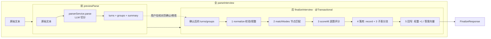

# S8 — Interview 面试复盘模块

> 状态：✅ 已落地（解析三接口 + 历史运营能力）
> 依赖：S0（基础设施）/ S1-S2（知识树）/ S6（项目树）/ S3（Study 的评分与 attempt 形态参考）
> Python 对照：`backend/api/interview.py` + `backend/services/interview_*.py` + `backend/models/interview.py`

---

## 0. 核心：解析三接口（前 / 后 / 全）+ Service 三拆分

> 本节是该模块的**核心**，详细说明对外只暴露的 3 个「解析」接口，以及它们背后的服务编排。
> 务必先读懂这一节，再看后面的历史细节。

### 0.1 对外只提供 3 个解析能力

| 口语称呼 | 接口（编排层方法） | HTTP | 作用 | 是否落库 |
|---|---|---|---|---|
| **前** | `previewParse(text)` | `POST /api/interview/preview-parse` | 纯文本 → `turns + groups`（让用户在校对页确认/修改） | ❌ 不落库 |
| **后** | `finalizeInterview(turns, groups, company, position)` | `POST /api/interview/finalize` | 用户确认后的 `turns/groups` → 匹配节点 + 评分 + 落库 + 统计 | ✅ 落库 |
| **全** | `parseInterview(text, company, position)` | `POST /api/interview/parse` | 一步到位 = 前 + 后（内部串联 preview→finalize） | ✅ 落库 |

设计原则：
- **「前」只做切分，不做任何判断/落库**——它的产物要展示给用户人工校对，必须可逆、零副作用。
- **「后」承担全部重活与事务**——节点匹配、评分、落库分流、知识点权重/向量回写，整段在一个 `@Transactional` 内。
- **「全」是「前」与「后」的顺序串联**——给「不需要人工校对、直接出结果」的快捷路径用，复用同样的编排方法，不复制逻辑。



### 0.2 Service 三拆分（解析 / asr / basic）

旧的单体 `InterviewCrudService` 已按职责拆为三类，互不混淆：

| 类别 | 类 | 职责 |
|---|---|---|
| **解析** | `InterviewParseService` / `InterviewParseServiceImpl` | 编排层，**只有 3 个方法**：`previewParse` / `finalizeInterview` / `parseInterview`。这是「前/后/全」的落点。 |
| **asr** | `InterviewAsrService` | 语音转写（`transcribe(file)`），独立成类，与文本解析解耦。 |
| **basic** | `InterviewBasicService` / `InterviewBasicServiceImpl` | 其余运营能力：历史列表/详情、去重、覆盖、草稿、重算（删旧建新，内部回调 `parseService.finalizeInterview`）、删除、改 meta。 |

公共纯函数（normalize/rebuildDialogue/collectQuestions/buildStats/sha256 等）抽到包内静态工具类
`InterviewServiceSupport`，由 Parse / Basic 两个 impl 静态导入复用，避免重复实现。

引擎 vs 编排（命名易混，务必区分）：
- `InterviewParserService`（**Parser**，带 r）= **底层引擎**，只负责 `parse(text)` 的 LLM 切分。
- `InterviewParseService`（**Parse**，无 r）= **编排层**，对外 3 接口；其内部注入字段名为 `parserService`，调用引擎完成「前」。

### 0.3 「后」finalize 的 5 步（与 Python `interview_crud.finalize` 对齐）

1. **normalize**：校验 `turns/groups` 非空，按 `InterviewServiceSupport.normalizeGroups` 规整——补默认 tag、按 tag 映射 `knowledge_point/topic`、重建对话文本、收集 question/answer。
2. **matchNodes**：`InterviewNodeMatcher.matchNodes(groups)`——knowledge 走向量 top_k=5 + 距离阈值 + LLM 重排（兜底 <0.25，孤儿挂「未命名知识点」）；project 走 root→topic→question 三级匹配/新建；algorithm/hr/other 跳过。
3. **scoreAll**：逐题调用 `InterviewScorerService` 评分，产出结构化 JSON（分数 + 分析）。
4. **落库分流**：插入 `interview_record` 主记录，再按 tag 把每题分流写入 `interview_knowledge_question` / `interview_project_question` / `interview_other_question`。
5. **回写**：命中知识节点 `interview_weight + 1`（封顶 5）；`storeAnswerEmbeddings` 写答案向量，供后续检索。

---

## 1. 现状盘点（代码已确认）

1. Java 端当前不存在 `interview/` 包（controller/service/mapper/entity 均未落地）。
2. 数据表在 V1 已有：
   - `interview_record`
   - `interview_knowledge_question`
   - `interview_project_question`
   - `interview_other_question`
3. Admin 删除节点时已做 FK 兜底：
   - 删知识节点会把 `interview_knowledge_question.knowledge_node_id` 置空
   - 删项目节点会把 `interview_project_question.project_node_id` 置空
4. Python 端面试复盘链路完整，具备可迁移语义基线。

---

## 2. 模块目标

把面试文本复盘链路在 Java 端完整落地：
1. 预解析（preview）：文本 -> turns + groups（不落库）
2. 提交（finalize）：匹配节点 + 评分 + 落库 + 统计
3. 历史：列表/详情/删除/重算/草稿
4. 去重：文本 hash 检测与覆盖

---

## 3. Java 端接口草案（遵循全 POST + body）

统一前缀：`/api/interview`

1. `POST /preview-parse`
- req: `{ text, company?, position? }`
- resp: `{ turns, groups, summary }`

2. `POST /finalize`
- req: `{ turns, groups, company?, position? }`
- resp: `{ record_id, groups, turns, stats, avg_score, pass_estimate, overall_analysis }`

3. `POST /parse`
- req: `{ text, company?, position? }`
- resp: 同 finalize（内部 preview + finalize）

4. `POST /check-duplicate`
- req: `{ text_hash }`
- resp: `{ duplicate, record_id?, company?, position?, created_at?, avg_score? }`

5. `POST /overwrite`
- req: `{ record_id }`
- resp: `{ deleted: true }`

6. `POST /draft`
- req: `{ record_id?, turns, groups, company?, position? }`
- resp: `{ record_id, is_draft_only, has_parsed }`

7. `POST /history-list`
- req: `{}`
- resp: `[{ id, company, position, avg_score, pass_estimate, created_at, has_parsed, has_draft }]`

8. `POST /history-detail`
- req: `{ record_id }`
- resp: `{ record_id, company, position, raw_text, turns, groups, stats, avg_score, pass_estimate, overall_analysis, has_draft, draft_turns, draft_groups }`

9. `POST /history-recalibrate`
- req: `{ record_id, turns, groups }`
- resp: 同 finalize（新 record_id）

说明（核心语义）：
- 用于“继续校准”场景：用户在校对页改了分组/回答后，希望按新内容重新匹配与重评分。
- 服务端执行策略为“删旧建新”：删除旧 record 及 3 张子表数据，再按新 turns/groups 走完整 finalize。
- 因为是新建记录，返回的 `record_id` 会变化；历史列表中体现为一条新记录。

10. `POST /history-delete`
- req: `{ record_id }`
- resp: `{ deleted: true }`

11. `POST /history-update-meta`
- req: `{ record_id, company?, position? }`
- resp: `{ id, company, position }`

---

## 4. 包结构（Java · 实际落地）

```
interview/
├── controller/
│   └── InterviewController.java          # 单文件，注入 parse/basic/asr 三个 service
├── service/
│   ├── InterviewParseService.java        # 解析编排（前/后/全 三方法）
│   ├── InterviewBasicService.java        # 历史/去重/草稿/重算/删除/改 meta
│   ├── InterviewAsrService.java          # 语音转写
│   ├── InterviewParserService.java       # 底层切分引擎（parse(text)）
│   ├── InterviewScorerService.java       # 评分引擎
│   └── impl/
│       ├── InterviewParseServiceImpl.java
│       ├── InterviewBasicServiceImpl.java
│       ├── InterviewServiceSupport.java  # 包内静态纯函数工具（normalize/sha256/...）
│       └── ...（Parser/Scorer/Asr impl）
├── matcher/
│   └── InterviewNodeMatcher.java         # 节点匹配 + 权重/向量回写
├── mapper/
│   ├── InterviewRecordMapper.java
│   ├── InterviewKnowledgeQuestionMapper.java
│   ├── InterviewProjectQuestionMapper.java
│   └── InterviewOtherQuestionMapper.java
├── entity/
│   └── InterviewRecord.java + 3 子表 entity
└── dto/
    ├── UploadTextRequest / FinalizeRequest / ...
    ├── PreviewParseResponse / FinalizeResponse
    └── ...
```

> 旧的 `InterviewCrudService`(Impl) 已删除，能力拆入上面的 解析 / asr / basic 三类。
> `InterviewProjectQuestionMapper` 复用 `project/mapper`。

---

## 5. 分阶段实现建议

### S8a（先跑通主链）
1. InterviewRecord + 3 子表 Mapper/Entity/DTO
2. `preview-parse` / `finalize` / `parse`
3. `history-list` / `history-detail`

### S8b（补运营能力）
1. `check-duplicate` / `overwrite`
2. `draft` / `history-recalibrate`
3. `history-delete` / `history-update-meta`

---

## 6. 与 Python 的有意识差异

1. 路由规范：Java 端统一 POST + body，不使用 path variable。
2. 并发策略：Java 用虚拟线程 + 受控并发（可先串行，后续补并发）。
3. 解析/评分 Prompt：先保持与 Python 同 key 兼容，再视质量差异做 Java 专属 prompt。

---

## 7. 已确认决策（2026-06-08）

1. 接口路径采用本文的 POST 命名（含 `history-list/history-detail`）。
2. S8a 先不做音频 ASR，仅做文本复盘。
3. 评分落库先走“固定 DTO -> 序列化 JSON”方案（不直接透传 Python 松散结构）。
4. `history-recalibrate` 保持“删除旧记录并新建”语义（record_id 变化）。

---

## 8. 验收口径（S8a）

1. 提交一段文本能拿到 `preview-parse` 的 turns/groups。
2. `finalize` 后 4 张表数据完整：record + knowledge/project/other 子表。
3. `history-list/history-detail` 能回看同一条记录并复现评分数据。
4. `check-duplicate` 对同文本 hash 返回 duplicate=true。
